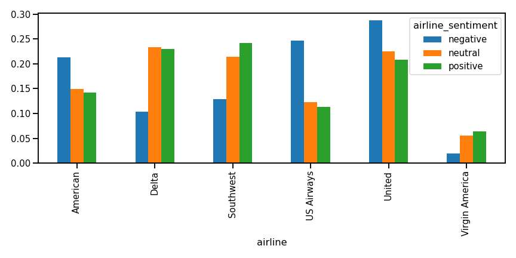
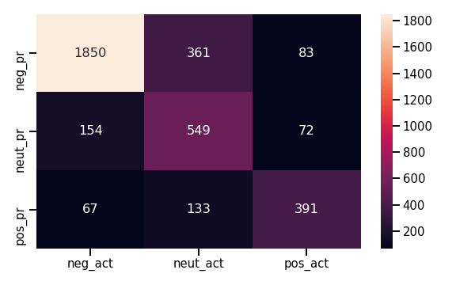
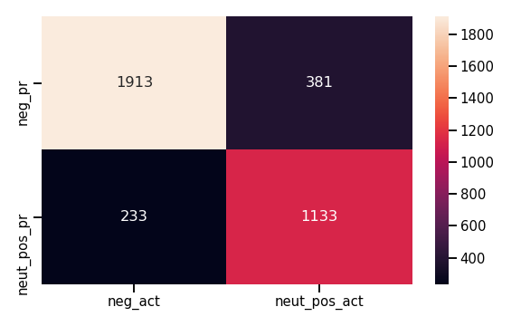

# airlines_sentiments
------------------------------------------------
#### Natural Language Processing (NLP) for sentiment analysis about US airline services scraped from Twitter. The goal is to identify "negative" emotions from labeled text dataset.

###### Text preprocessing steps were summarized in two major pipeline classes: 

  > Class-1: before Tokenization (PreprocessTransform())
   - a. Html tag removal
   - b. Translate emoji
   - c. Replace contructions
   - d. Remove the numbers.
   - e. <b>Tokenization</b>

  > Class-2: after Tokenization (TokenizeLemmatize(PreprocessTransform))
   - f. Removal of Non-ASCII, Special Characters and Punctuations
   - g. Conversion to lowercase
   - h. Removal of stopwords
   - i. Lemmitization
   - j. Join the words in the list to convert back to text string in the dataframe
   
###### Text Classifier pipeline steps (including tuning with GridSearch) constructed from: 
 - 1. PreprocessTransform
 - 2. TokenizeLemmatize
 - 3. CountVectorizor (optimal found with 2000 features, 0.7 max document frequency)
 - 4. LogisticRegression Classifier - with tree classes (including "neutral" ~ unclear if negative or neutral); and with two classes: "negative" and "non-negative")
    
    Sentimets per Airline:
    
    
    
    Confusion matrix for three classes (negative, neutral and positive); with precision of 0.89 and recall of 0.81 for the negative class:
   
   
   
   Confusion matrix for two classes (negative and non-negative); with precision of 0.89 and recall of 0.83 for the negative class:
   
   
   

